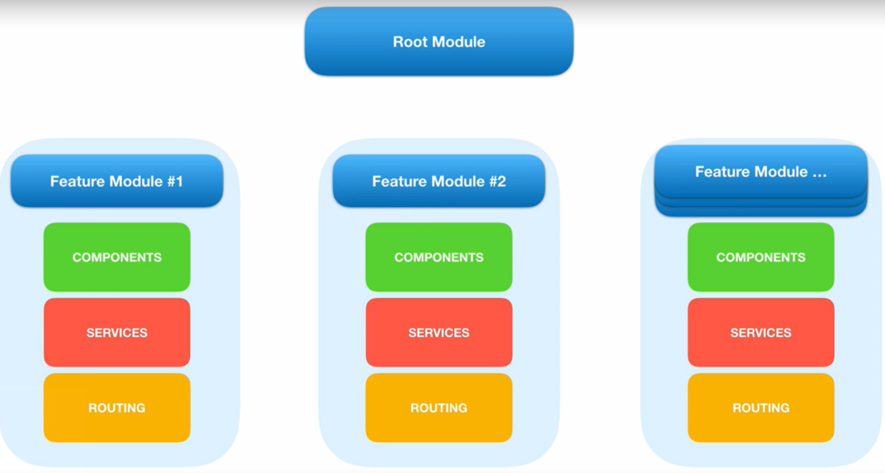
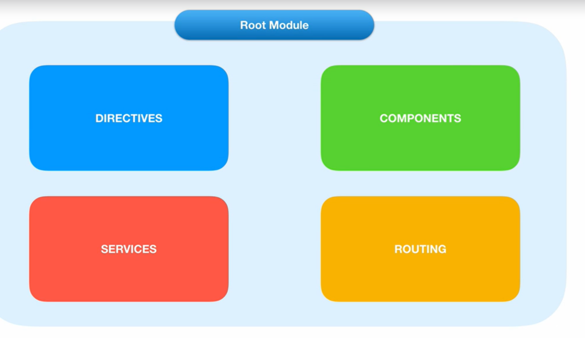
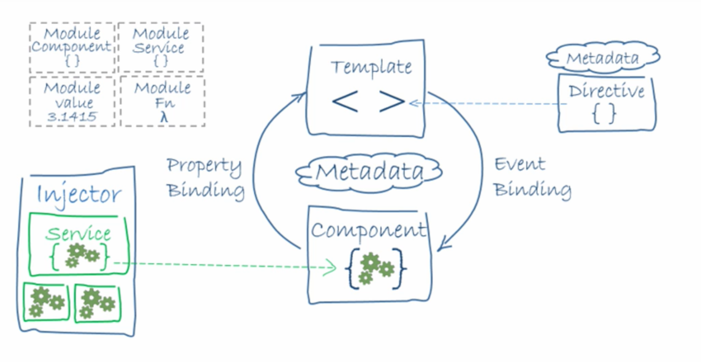

# Guru Raghavendra Vaibhava

## Angular

-	Angular is the latest development framework from Google for building web, desktop and mobile applications
-	Typescript is used to develop the angular framework
-	Angular 2 released in 2016

## Local Dev set-up

-	node 
-	npm
-	git

##	 Node JS

-	node is javascript runtime enviroment
-	node is not javascript framework
-	node is a programming language
-	node is open source cross platform runtime built on top of chrome's v8 javascript engine
-	node enables to use javascript at server-side application
-	node powers npm node package manager

##	npm

-	Nodejs package manager 
-	npm is open source package manager for nodejs
-	npm is the largest package ecosystem in the world
-	npm provides thousands of packages and libraries that we can use in our web application
-	npm uses package.json file as configuration file to download all the packages required by application

##	package.json file

-	package.json file defines application details and dependencies used by application
-	package.json will have name, version, desciption, author, license and dependencies section
-	dependencies section will contains the packages used by the application

##	node and npm installation

-	installing node will automatically install npm

##  Updating NodeJS and NPM on Windows

-	open cmd promt in admin mode or open in power shell
-	set unrestricted execution scope
-	install npm-windows-upgrade package

		npm install --global --production npm-windows-upgrade
		
		npm-windows-upgrade --npm-version 3.5.0
		
##	NVM (Node Version Manager) 

-	NVM is best used to upgrade the nodejs
-	download the zip and extract and execute the exe file
-	NVM will be installed like most of the windows exe file
-	once installed we can execute
	
		nvm install latest
		nvm install 6.10.1
		nvm install 6.10.1 32
		
		
		
## Angular cli installation

-	angular cli is used to create an anuglar application
-	used to compile and deploy the app 

		npm install -g @angular/cli
		npm install @angular/cli -- local mode with in folder
		npm install -g @angular/cli@6.1.1
		ng new PROJECT-NAME
		ng serve
		ng serve --host 0.0.0.0 --port 4201
		ng g component my-new-component
		ng build --prod
		

Scaffold |	Usage
---------|----------
Component	| ng g component my-new-component
Directive	| ng g directive my-new-directive
Pipe	| ng g pipe my-new-pipe
Service	| ng g service my-new-service
Class	| ng g class my-new-class
Guard	| ng g guard my-new-guard
Interface	| ng g interface my-new-interface
Enum	| ng g enum my-new-enum
Module	| ng g module my-module
		

## uninstall angular CLI

-	To update Angular CLI to a new version, you must update both the global package and your project's local package.

	
	npm uninstall -g angular-cli
	npm cache verify
	npm cach clean
	npm install -g angular/cli@latest
	
	
	rm -rf node_modules dist 
	npm install --save-dev @angular/cli@latest
	npm install

##	Creating new angular app

-	Angualr app can be created via

	-	plunkr
	- 	StackBlitz
	-	cli ng new app-name
	

##	 Angular Project Structure

-	root
	-	src 
		-	contains source files
	-	e2e 
		-	contains test files
		
		
	-	src
		-	app
		-	assets
		-	enviroment 
	

## Important files of Angular 

-	package.json file

	-	defines name, author, version, scripts, dependencies
	
-	angular-cli.json

	-	
	-	project name
	-	schema
	-	defines the app structure
	-	outDir
	-	index.html
	-	styles
	-	scripts
	-	enviroments
	-	contains port and host for local dev
	-	point to main.ts, polyfills.ts, test.ts,tsconfig.json, styles.css, index.html files under the src folder	
	

-	enviroment.ts
	
	-	used to define the enviroment specific properties that will be applicable for the whole application
	-	ex: dev and prod can defined as an const properties specific to enviroment
	

- tsconfig.ts

	-	tsconfig file contains details about typescript version
	-	typescript compiler configuration for the application
	
	
-	main.ts 
	-	main entry point for the application
	
-	test.ts
	-	main entry point for unit tests
	
	
-	polyfills

	-	makes modern browser functionality work in old browsers
	
-	index.html
	-	main html will that will accessed the end user
	
	
-	karma.js

	-	unit test configuration for karma test
	
-	protractor.js

	-	end-to-end configuration for protactor

## Angular Architecture

-	Angular is modular based framework
-	It has root module called App Module which bootstap the angular app and controls other feature modules
-	Every Angular application has atleast one NgModule class which is Root module. By default this will be AppModule
-	The main parts of the angular application are Components, Services, directives, routing
-	Components are building block of angular application which can fetch the data using services and transforms the DOM using directives and redirect to other component using routing
-	Every component will have ui template and communication b/w template and component will happen using property binding and event binding
-	Component, services and routing will have metadata called decorator that explains what it is
-	Angular application will developed with typescript and typescript will transpiled to javascript 
-	Transpilation is a process of transpiling typescript to javascript

##	Angular core components

-	Components
	
	-	Building block
	-	Reusable component
	-	Component is a combination of view and controller
	-	Component is one of the type of Directive or Directive is father of Components
	
		import {component} from 'angular/core';
	
		@Component({
			
			selector: 'transaction-search',
			templateUrl: './transaction-search.html',
			styleUrls: ['']
		
		}) 
		export class TransactionSearch {
		
		
		}
	
	
	
	
-	Services

	-	Service is used to fetch data from API or Datasource
	-	Service implement the concept of Dependency injection
	-	Service will be injected to Component to get the data from API
		
		
			@Injectable()
			export class TransactionService {
			
			}
	
-	Routing

	-	Router enables navigation to angular application
	-	Router enables navigation from one view to another view or Component
	
-	Directives
	-	Directive are class that add behavior to specific elements in the DOM
	-	This behavior can add or remove certain elements on the DOM
	-	Adding specific styles to element on DOM
	-	3 types
		-	Attribute
		-	Structural
		-	Components
		
			
 Student

			

			
				
				import {Directive} from '@angular/core';
				@Directive({
				
					selector:'[myDirective]'
				
				})
				export class MyDirective {
				
				
				}
				

##	Root Components and module of angular app

-	AppModule or app.module.ts is the root module of the angular application
	-	Each and every components and services, gaurds, shared modules needs to register in the app.module
	-	AppModule will have @NgModule
	-	Shared modules can be utilized to separate the modules separately like 
	
	-	app.shared.module.ts
	
		-	Angular modules
			-	FormsModule
			-	ReactiveFormsModule
			-	HttpModule
			-	HttpClientModule
			
		-	Material modules
		
			-	MatButtonModule
			-	MatCardModule
			-	MatIconModule
			-	MatListModule
			-	MatDividerModule
			-	MatMenuModule
			-	MatSidenavModule
			-	MatSidenavModule
			-	MatFormFieldModule
			
		-	Covalent modules
			 CovalentDataTableModule,
			-	CovalentMediaModule
			-	CovalentLoadingModule
			-	CovalentNotificationsModule
			-	CovalentSearchModule
			-	CovalentDialogsModule
			-	CovalentJsonFormatterModule

-	app.component.ts 

	-	This is root component all of all the components
	-	AppComponent has html,css, spec
	-	app.component.html can contains router-outlet to enable the routing or navigation of loading the components according to urls
	-	app.component or AppComponent will used while bootstraping the application with app.module or AppModule

-	app.routing.ts
	
	-	Angular RouterModule will be register with the app.module.ts
	-	contains the routing logic
	-	url will be matched to component
	-	in root component html's we need to router-outlet to enable routing

-	app.component.html
	
	- root html component

-	app.component.css
	-	root style component
	

##	Angualar Annotations

-	@NgModule Annotation

	- Will have following attributes
	
		-	declarations
			
			-	used to register the components
			-	Specifies a list of directives/pipes that belong to this module.

		-	imports
		
			-	Used to register exported modules
			-	Specifies a list of modules whose exported directives/pipes should be available to templates in this module.
		
		-	providers
			-	Used to register pipes, directives, services, interceptor, gaurds
			-	Defines the set of injectable objects that are available in the injector of this module.

		-	bootstrap
			
			-	Defines the components that should be bootstrapped when this module is bootstrapped.
			-	The components listed here will automatically be added to entryComponents.
			
		-	exports
		
			-	Specifies a list of directives/pipes/modules that can be used within the template of any component that is part of an Angular module that imports this Angular module.

## Metadata 

-	Angular decorator makes regular typescript class to classify into different forms
-	Metadata or decorator tells Angular framework how to process the regular typscript class using decorators or annotations
-	Decorator starts with @ and contains meta properties in json format
-	common decorators are @NgModule, @Component, @Input, @Output, @Injectable, @Directive

## Directives

-	A Directive is basically a javascript class with an @Directive decorator that directs or instructs what to do
-	There are 2 kinds of directives
	-	Structural
	-	Attribute
	
-	Structural
	-	alters the DOM by adding, removing, replacing elements of DOM
	
-	Attribute
	-	Alters the appearance or behavior of the existing DOM elements
	

##	Components

-	Component is a type of directive
-	Components are building block of Angualar
-	Components is like view and controller
-	Component makes use of service to fetch data API call and feeds that data to template
-	Component feeds data template either using property binding or event binding
-	Selector is a attribute in a @Component decorator
-	Selector is used to embed the component to Html template of another component

##	Angular templates

-	Angular template is view part of an Component
-	Angular template will have html logic
-	Template tells how to render the component
-	We can embed one template into another html template
-	Example like summary of quartz failed, success, assigned, ignored etc
-	Transaction report chart by input channel, source application, 	request type, vendor type
-	In a angular template we can declare interpolation variable, template reference variable, template expressions and many others #templateVariable
-	Template reference variable is a reference to DOM element
	
	-	#tempalteVariable can also be reference to angular component or directive

## Angular service

-	Service is used to Fetch the data from API call or data source
- 	Service is a injectable component in angular
-	Service can be used to write business logic like converting API response from to one format to another format
- 	Service will injected to angular component using Dependency injection
- 	Service is a reusable component 
-	Servicd is used to have separation of concerns

##	Dependency Injection

-	Dependency injection is a way of injecting required dependencies to another instance
-	Dependency injection in angular is making way for component to fetch data from API call
-	Dependency injection will be done through Constructor of service or component
-	A marker decorator called @Injectable should be used to make it injectable to another service or component
-	3 steps to do dependency injection

	- 	import
	-	add that dependency as parameter to Component constructor
	-	Call the service method to fetch the data from API
	
	
##	Data Binding

-	Server will send the html response and browser will process the html response
-	Hmtl document is a DOM tree
-	DOM is a tree structure of html elements
-	javascript can change the structure of DOM at browser

	-	Data Bindind is binding the data from DOM to Javascript
	
-	In Angualar, there are 4 types of binding
	
	-	Interpolation 
	
		-	Interpolation is done using double curly braces {{}}
		-	It's binding the data from view to view
		-	It's a one way binding
		
	-	Property Binding
		-	Property Binding is mainly used to send values of variables from parent component to property of child component
		-	Property Binding b/w parent and child component is achieved throug @Input decorator
		-	Hence the name property Binding
		-	Property Binding is done using []
		-	This can be either Component to view or view to Component
		-	syntax for property binding is [] inside html document
		-	Property binding is one-way binding
		
	-	Event Binding 
		-	Event Binding passes the value of variable to a method in the component on an event
		-	Syntax for event binding is () inside html document
		
	-	Two-Way Binding
		-	Two Binding is a combination of event and property binding
		-	It combines event binding and property binding through ngModel directive
		-	Two binding synchronizes the data b/w both component and dom
		-	In two-way binding changing value at view or component will be reflected at another side
			
			-	Two way binding is done thourgh ngModel directive
			-	syntax for two-way binding is [()]
			
			
			
##	
		
			
	
	
	
	

